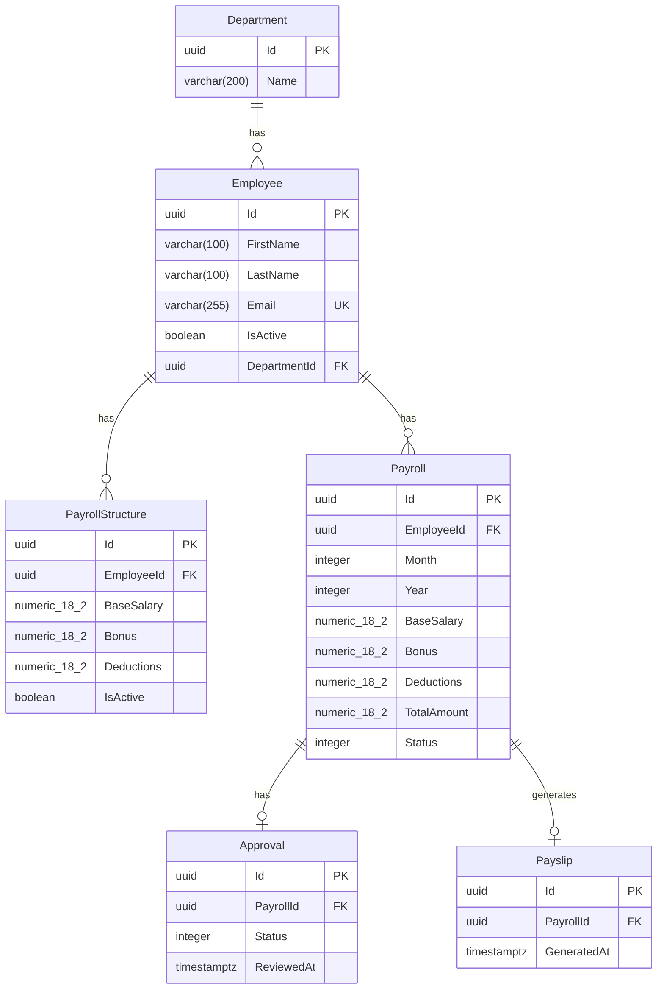

# Database Design — Person 3

## ER Diagram (ASCII)

```
┌──────────────────┐
│    Department     │
├──────────────────┤
│ PK Id (uuid)     │
│    Name (varchar) │
└───────┬──────────┘
        │ 1
        │
        │ N
┌───────▼──────────────┐
│      Employee         │
├──────────────────────┤
│ PK Id (uuid)         │
│    FirstName (100)   │
│    LastName (100)    │
│    Email (255) UQ    │
│    IsActive (bool)   │
│ FK DepartmentId      │
└───┬──────────────────┘
    │ 1
    │
    ├─── N ──────────────────────┐
    │                            │
    │ 1                          │ 1
┌───▼───────────────────┐  ┌────▼──────────────────┐
│   PayrollStructure    │  │       Payroll          │
├───────────────────────┤  ├────────────────────────┤
│ PK Id (uuid)          │  │ PK Id (uuid)           │
│    BaseSalary (18,2)  │  │    Month (int)         │
│    Bonus (18,2)       │  │    Year (int)          │
│    Deductions (18,2)  │  │    BaseSalary (18,2)   │
│    IsActive (bool)    │  │    Bonus (18,2)        │
│ FK EmployeeId         │  │    Deductions (18,2)   │
└───────────────────────┘  │    TotalAmount (18,2)  │
                           │    Status (enum)       │
                           │ FK EmployeeId          │
                           └───┬────────────────────┘
                               │ 1
                               │
                   ┌───────────┤───────────┐
                   │ N                     │ N
           ┌───────▼────────┐   ┌──────────▼───────┐
           │    Approval     │   │     Payslip       │
           ├─────────────────┤   ├──────────────────┤
           │ PK Id (uuid)    │   │ PK Id (uuid)     │
           │    Status (enum)│   │    GeneratedAt   │
           │    ReviewedAt   │   │ FK PayrollId     │
           │ FK PayrollId    │   └──────────────────┘
           └─────────────────┘
```

## ER Diagram (Mermaid)



## Relationships

| From | To | Type | FK | On Delete |
|---|---|---|---|---|
| Employee | Department | N:1 | DepartmentId | Restrict |
| PayrollStructure | Employee | N:1 | EmployeeId | Cascade |
| Payroll | Employee | N:1 | EmployeeId | Cascade |
| Approval | Payroll | N:1 | PayrollId | Cascade |
| Payslip | Payroll | N:1 | PayrollId | Cascade |

## Indexes

| Table | Column(s) | Type |
|---|---|---|
| Employee | Email | Unique |
| Payroll | EmployeeId, Month, Year | Unique (prevents duplicate payroll per month) |

## Column Types

- Monetary values: `numeric(18,2)`
- Primary keys: `uuid`
- Timestamps: `timestamp with time zone`
- Enums stored as: `integer`

## Enums

**PayrollStatus**: Draft (1), Approved (2)

**ApprovalStatus**: Pending (1), Approved (2), Rejected (3)
