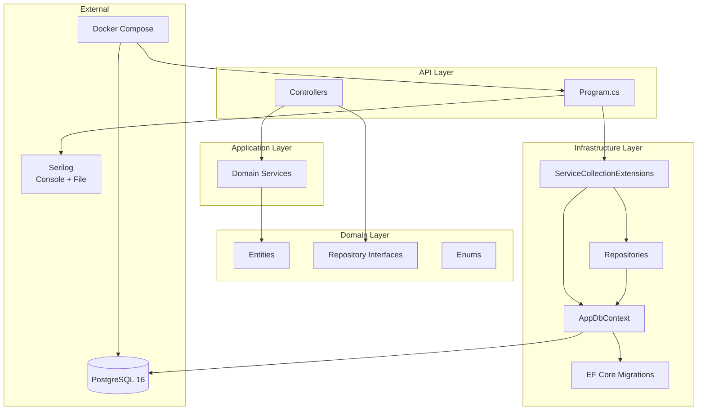
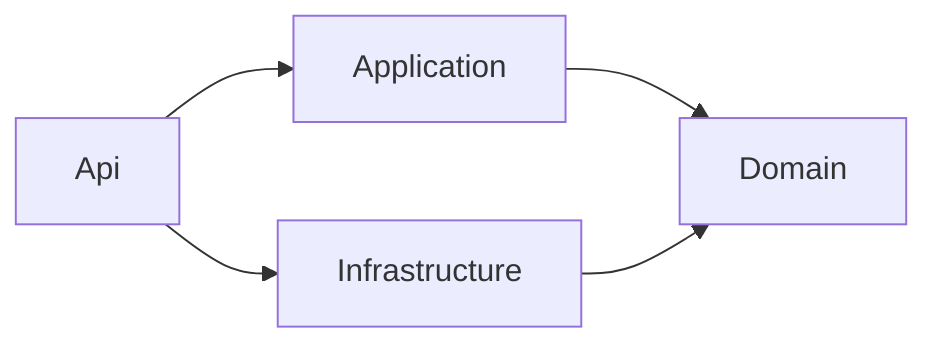
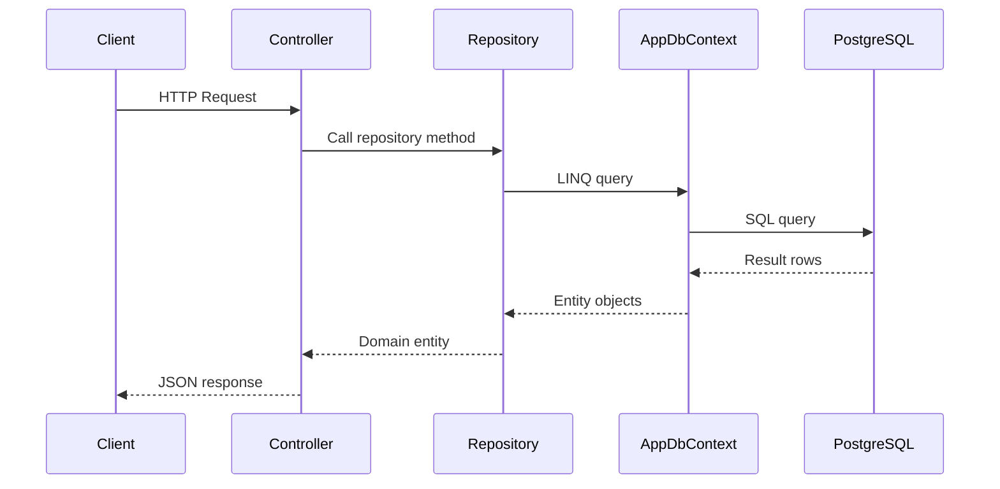
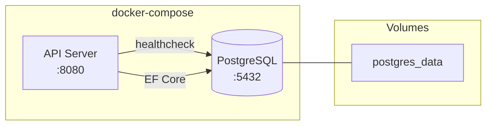

# Infrastructure Setup — Person 3

## Tech Stack

| Component | Technology | Version |
|---|---|---|
| Database | PostgreSQL | 16 (Alpine) |
| ORM | Entity Framework Core | 8.0.11 |
| DB Provider | Npgsql.EntityFrameworkCore.PostgreSQL | 8.0.11 |
| Logging | Serilog.AspNetCore | 8.0.3 |
| Containerization | Docker | - |

## Architecture Overview (Mermaid)



## Project Dependencies (Mermaid)



## Request Flow (Mermaid)



## Docker Architecture (Mermaid)



## Repository Pattern (Mermaid)

```mermaid
classDiagram
    class IEmployeeRepository {
        <<interface>>
        +GetByIdAsync(Guid) Task~Employee?~
        +GetAllAsync() Task~IReadOnlyList~
        +AddAsync(Employee) Task
        +UpdateAsync(Employee) Task
    }

    class IPayrollRepository {
        <<interface>>
        +GetByIdAsync(Guid) Task~Payroll?~
        +GetAllAsync() Task~IReadOnlyList~
        +GetByEmployeeIdAsync(Guid) Task~IReadOnlyList~
        +ExistsForMonthAsync(Guid, int, int) Task~bool~
        +AddAsync(Payroll) Task
        +UpdateAsync(Payroll) Task
    }

    class IApprovalRepository {
        <<interface>>
        +GetByIdAsync(Guid) Task~Approval?~
        +GetByPayrollIdAsync(Guid) Task~Approval?~
        +AddAsync(Approval) Task
        +UpdateAsync(Approval) Task
    }

    class IPayrollStructureRepository {
        <<interface>>
        +GetActiveByEmployeeIdAsync(Guid) Task~PayrollStructure?~
        +AddAsync(PayrollStructure) Task
        +UpdateAsync(PayrollStructure) Task
    }

    class IPayslipRepository {
        <<interface>>
        +GetByIdAsync(Guid) Task~Payslip?~
        +GetByPayrollIdAsync(Guid) Task~Payslip?~
        +AddAsync(Payslip) Task
    }

    class IDepartmentRepository {
        <<interface>>
        +GetByIdAsync(Guid) Task~Department?~
        +GetAllAsync() Task~IReadOnlyList~
        +AddAsync(Department) Task
    }

    class EmployeeRepository {
        -_context: AppDbContext
        +GetByIdAsync(Guid) Task~Employee?~
        +GetAllAsync() Task~IReadOnlyList~
        +AddAsync(Employee) Task
        +UpdateAsync(Employee) Task
    }

    class PayrollRepository {
        -_context: AppDbContext
        +GetByIdAsync(Guid) Task~Payroll?~
        +GetAllAsync() Task~IReadOnlyList~
        +GetByEmployeeIdAsync(Guid) Task~IReadOnlyList~
        +ExistsForMonthAsync(Guid, int, int) Task~bool~
        +AddAsync(Payroll) Task
        +UpdateAsync(Payroll) Task
    }

    IEmployeeRepository <|.. EmployeeRepository
    IPayrollRepository <|.. PayrollRepository
```



## Project Structure

```
src/PayrollApprovalSystem.Infrastructure/
├── Extensions/
│   └── ServiceCollectionExtensions.cs   # DI registration (AddInfrastructure)
├── Persistence/
│   ├── AppDbContext.cs                  # EF Core DbContext with entity configuration
│   └── Migrations/
│       ├── 20260412185514_InitialCreate.cs
│       ├── 20260412185514_InitialCreate.Designer.cs
│       └── AppDbContextModelSnapshot.cs
├── Repositories/
│   ├── ApprovalRepository.cs
│   ├── DepartmentRepository.cs
│   ├── EmployeeRepository.cs
│   ├── PayrollRepository.cs
│   ├── PayrollStructureRepository.cs
│   └── PayslipRepository.cs
└── PayrollApprovalSystem.Infrastructure.csproj
```

```
src/PayrollApprovalSystem.Domain/
└── Interfaces/
    ├── IApprovalRepository.cs
    ├── IDepartmentRepository.cs
    ├── IEmployeeRepository.cs
    ├── IPayrollRepository.cs
    ├── IPayrollStructureRepository.cs
    └── IPayslipRepository.cs
```

## Repository Layer

Interfaces live in the **Domain** layer (no infrastructure dependencies). Implementations live in **Infrastructure**.

| Interface | Implementation | Key Methods |
|---|---|---|
| IEmployeeRepository | EmployeeRepository | GetById, GetAll, Add, Update |
| IPayrollRepository | PayrollRepository | GetById, GetAll, GetByEmployeeId, ExistsForMonth, Add, Update |
| IApprovalRepository | ApprovalRepository | GetById, GetByPayrollId, Add, Update |
| IPayrollStructureRepository | PayrollStructureRepository | GetActiveByEmployeeId, Add, Update |
| IPayslipRepository | PayslipRepository | GetById, GetByPayrollId, Add |
| IDepartmentRepository | DepartmentRepository | GetById, GetAll, Add |

All repositories follow the same pattern: constructor-injected `AppDbContext`, `SaveChangesAsync` after each mutation.

> **Design decision:** Each repository method calls `SaveChangesAsync` immediately rather than deferring to a Unit of Work. This gives explicit transaction boundaries per operation and makes each mutation independently testable. For the current scope, each service operation maps to a single aggregate root, so immediate save is acceptable. If future requirements need multi-aggregate transactions, the pattern can be refactored to expose `SaveChangesAsync` at the service layer.

## DbContext Configuration

`AppDbContext` configures entities via `OnModelCreating`:

- Primary keys, max lengths, required fields
- `decimal(18,2)` for all monetary columns
- Foreign keys with cascade/restrict delete behaviors
- Unique composite index on `Payroll(EmployeeId, Month, Year)` — enforces the business rule "no duplicate payroll per month"
- Unique index on `Employee.Email`

## Database Migrations

Create a migration:
```bash
dotnet ef migrations add <MigrationName> \
  --project src/PayrollApprovalSystem.Infrastructure/PayrollApprovalSystem.Infrastructure.csproj \
  --startup-project src/PayrollApprovalSystem.Api/PayrollApprovalSystem.Api.csproj \
  --output-dir Persistence/Migrations
```

Apply migrations (against running PostgreSQL):
```bash
dotnet ef database update \
  --project src/PayrollApprovalSystem.Infrastructure/PayrollApprovalSystem.Infrastructure.csproj \
  --startup-project src/PayrollApprovalSystem.Api/PayrollApprovalSystem.Api.csproj
```

Remove last migration (before applying):
```bash
dotnet ef migrations remove \
  --project src/PayrollApprovalSystem.Infrastructure/PayrollApprovalSystem.Infrastructure.csproj \
  --startup-project src/PayrollApprovalSystem.Api/PayrollApprovalSystem.Api.csproj
```

## Docker

### Files

| File | Purpose |
|---|---|
| `Dockerfile` | Multi-stage build (SDK → runtime), publishes API |
| `docker-compose.yml` | PostgreSQL 16 + API service with healthcheck |
| `.dockerignore` | Excludes bin, obj, .git, tests |

### Running

```bash
docker-compose up --build
```

- PostgreSQL: `localhost:5432`
- API: `localhost:8080`
- Swagger: `http://localhost:8080/swagger`

The API service waits for PostgreSQL healthcheck before starting.

## Configuration

### appsettings.json

```json
{
  "ConnectionStrings": {
    "DefaultConnection": ""
  }
}
```

Credentials are stored in `appsettings.Development.json` (gitignored) for local development.

In Docker, the connection string is overridden via environment variable:
```
ConnectionStrings__DefaultConnection=Host=postgres;Port=5432;...
```

### Environment Variables

| Variable | Description |
|---|---|
| `ASPNETCORE_ENVIRONMENT` | `Development` / `Production` |
| `ConnectionStrings__DefaultConnection` | Overrides PostgreSQL connection string |
| `JwtSettings__Key` | Overrides JWT signing key (production) |

## Logging (Serilog)

Configured in `appsettings.json` under the `Serilog` section:

- **Console sink**: enabled by default
- **File sink**: rolling daily logs to `logs/payroll-{Date}.log`, retained 30 days
- **EF Core**: logged at `Warning` level (no query noise in production)
- **ASP.NET Core**: logged at `Warning` level

`Program.cs` uses bootstrap logger for startup errors + host-configured logger for runtime.

## DI Registration

Single extension method wires everything:

```csharp
builder.Services.AddInfrastructure(
    builder.Configuration.GetConnectionString("DefaultConnection")!);
```

This registers:
- `AppDbContext` (scoped)
- All 6 repository interfaces → implementations (scoped)
